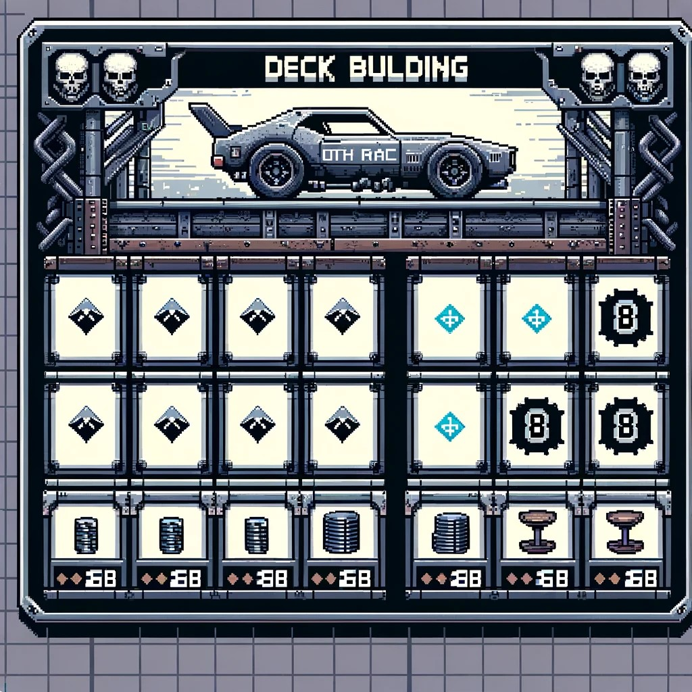

# **Death Race**

## _Game Design Document_

---

##### **Documento Creado por Emiliano Romero A01028415, Joseph Shakalo A01784107 y Nicolas Alarcon A01783704**
Todos los derechos reservados. Ninguna parte de este documento puede ser reproducida, almacenada en un sistema de recuperación o transmitida en cualquier forma o por cualquier medio, electrónico, mecánico, fotocopia, grabación o cualquier otro, sin el permiso previo por escrito del titular del GDD , excepto en el caso de breves citas incluidas en reseñas críticas y ciertos otros usos no comerciales permitidos por la ley de derechos de autor.

## _Logo_

##
## _Índice_

---

1. [Índice](#Índice)
2. [Diseño de juego](#Diseño-de-juego)
    1. [Resumen](#Resumen)
    2. [Gameplay](#Gameplay)
    3. [Mentalidad](#Mentalidad)
3. [Técnico](#Técnico)
    1. [Pantallas](#Pantallas)
    2. [Controles](#Controles)
    3. [Mecánicas](#Mecánicas)
4. [Diseño de niveles](#Diseño-de-niveles)
    1. [Temas](#Temas)
    2. [Flujo del juego](#Flujo-del-juego)
5. [Desarrollo](#Desarrollo)
    1. [Clases abstractas](#Clases-abstractas--componentes)
    2. [Clases derivadas](#Clases-derivadas--Composición-de-componentes)
6. [Gráficos](#Gráficos)
    1. [Atributos de estilo](#Atributos-de-estilo)
    2. [Gráficos requeridos](#Gráficos-requeridos)
7. [Sonidos/música](#Sonidosmúsica)
    1. [Atributos de estilo](#Atributos-de-estilo)
    2. [Sonidos requeridos](#Sonidos-requeridos)
    3. [Música requerida](#Música-requerida)
8. [Itinerario](#Itinerario)

## _Diseño de juego_

---

### **Resumen**

Los objetivos del juego son llegar la meta primero o eliminar el vehículo del oponente. Cada jugador tiene cierto valor de vida y de velocidad predeterminada al inicio del juego. Es un juego por turnos en el cual en cada turno el jugador recibe cierta cantidad de energía para gastar en ciertas cartas que saldrán de su mazo, las cuales se dividen en 3 categorías: ataque, defensa, y velocidad. Cada jugador durante su turno podra ver las cartas que tendra su oponente en su siguiente ronda para armar su estrategia. El jugador puede elegir cualquier estrategia en su uso de cartas que lo lleve la victoria.

### **Gameplay**

En este juego, cada jugador tiene un tiempo asignado para completar su turno. En su primer turno, reciben 4 cartas aleatoriamente y 10 puntos de energía predeterminada para cada turno. Cada carta tiene un costo de energía a su vez que un valor de atributo y/o un efecto. Las cartas se dividen en tres categorías: Ataque, que  daña al vehículo del oponente o reduce su velocidad o capacidad para avanzar durante un turno; Defensa, que disminuye o anula los ataques del oponente durante el turno; y Velocidad, que inicialmente establece una velocidad constante, pero al usarse, puede aumentar la distancia recorrida o la velocidad del vehículo por el resto de la partida o un turno.

Las cartas se clasifican por costos de energía, cuanto más alto sea el costo, más fuertes serán los atributos y efecto de la carta. Además, las cartas pueden interactuar entre sí, ya sea anulando o potenciando sus efectos entre ellas. Algunas cartas pueden comprometer al jugador, ya sea afectando la velocidad, la capacidad ofensiva o la capacidad defensiva como contraparte a los beneficios que ofrecen.

Durante su turno, el jugador tiene la capacidad de ver la categoría (Ataque, Defensa y Velocidad) de las cartas que su oponente tiene en su mano, lo que le permite planificar su estrategia. Cada carta usada por el jugador será puesta en un montón apartado al mazo a menos de que se indique lo opuesto, siendo remplazada por otra hasta el inicio de su siguiente turno. Una vez que se agoten las cartas del mazo principal, el montón de cartas usadas se revuelve y se devuelve al mazo para seguir jugando.

### **Mentalidad**

Los sentiminetos que queremos provocar al jugador son adrenalina, que se sienta apresurado, intentando recrear senitmientos de una carerra. Estos se buscaran conseguir poniendo un contador de tiempo por cada turno a su vez que con musica ambientada acordemente.

## _Técnico_

---

### **Pantallas**

1. Pantalla Principal: 

    
    
    Bienvenidos a la entrada del juego, donde los jugadores son recibidos con el nombre del juego resaltado, acompañado de una música inmersiva y una imagen representativa del entorno del juego. Esta pantalla también proporciona una introducción concisa a la temática y la historia del juego, estableciendo el contexto para la aventura que está por comenzar.

2. Pantalla de Menú: 

    
    
    Este espacio sirve como un cruce de caminos para el jugador, ofreciendo opciones para navegar hacia la acción del juego, la creación de un mazo y explorar las estadísticas del jugador. Decorado con una imagen de fondo temática y animaciones musicales, este menú también incluye instrucciones breves sobre cómo jugar, haciendo que la transición hacia la partida sea fluida y atractiva.

3. Pantallas del Juego: 

    

    

    

    Los jugadores se enfrentarán a carreras llenas de desafíos en diversos entornos, cada uno con su propio diseño y temática. Además, esta pantalla muestra las cartas de juego disponibles para el jugador, preparadas para la estrategia y el combate.

4. Pantalla de Estadísticas:

    
    
     Un espacio dedicado a mostrar los logros del jugador, incluyendo récords históricos y análisis detallados de las cartas utilizadas en el juego, ofreciendo así un vistazo a las estrategias más exitosas.

5. Pantalla de Creación de Mazos: 

    
    
    Aquí, los jugadores tienen la oportunidad de personalizar su mazo, eligiendo entre una amplia selección de cartas, cada una con su propia imagen y descripción, permitiendo una estrategia y personalización profundas.

### **Estadísticas**

Las estadísticas que recopilaremos del jugador serán presentadas en una pestaña en la sección del jugador en el cual serán de acuerdo a la cantidad de victorias del jugador, carta menos usada, carta mas usada y promedio de turnos por partida.

Estas estadísticas será mostradas en el menú de estadísticas al jugador con el objetivo que el ususario sepa su comportamiento dentro del juego. Además, las usaremos para balancear el juego y mejorar la experiencia con base en la información recopilada.

### **Controles**

El jugador interactúa con el juego utilizando su cursor. Para seleccionar una carta, se coloca el cursor sobre esa carta y se hace click para escogerla. Lo mismo aplica para los botones de interacción de la interfaz de juego. 

### **Mecánicas**

**Victoria**: 
El objetivo principal del juego es ganar la carrera. Esto se puede conseguir de dos formas: Llegar a la meta antes que el rival o destruir el coche del rival. Para llegar a la meta antes se debe avanzar cierta distancia en casillas (dependiendo de la pista), por medio del uso de cartas que otorgan "velocidad". Para destruir el coche del rival se debe agotar sus puntos de salud (PS) por medio del uso de cartas que inflingen daño. El uso de cartas que otorgan defensa protegen al usuario del daño infligido por las cartas del rival. Al ser una carrera entre dos jugadores, solo hay un ganador y un perdedor. La partida termina en cuanto se determina uno. 

**Turno**: 

1. En cada turno se otorga energía máxima a cada jugador. La energía no se acumula de un turno al siguiente, por ejemplo si se termina un turno con 3/10 de energía el jugador tendra 10/10 en el seguiente turno, no 13/10. 

0. Se inicia cada turno con 4 cartas de la pila del jugador, esta será la mano del jugador para este turno. Se arranca el contador para indicar el tiempo que tiene el jugador para seleccionar sus cartas. **Si el tiempo se agota y el jugador no confirma su decisión, no se jugará ninguna carta.**

0. Para cada carta del rival, se muestra su tipo (ataque, defensa o velocidad), mostrando así las posibles intenciones que tendrá en ese turno. El jugador escoge sus cartas tomando en cuenta esta información. 

0. Una vez seleccionadas las cartas y con la decisión confirmada, se juegan las cartas tanto del rival como del jugador al mismo tiempo. Primero se aplican los efectos de defensa, luego los de ataque y finalmente los de velocidad. Si no se usaron cartas que los afecten, los valores por defecto son los establecidos en la carta de cada coche. **La velocidad por defecto puede verse afectada por las cartas jugadas por el rival o el jugador.** 

0. Para finalizar el turno, se conservan las cartas no jugadas. Se anulan los efectos de las cartas jugadas durante este turno a menos que se indique lo contrario, y se muestra el progreso de las casillas avanzadas. 

0. Cuando el mazo este vacio las cartas usadas en turno pasados seran revueltas y regresadas al mazo para que el jugador siempre tenga cartas pero se mantenga la aletoriedad de las cartas sacadas del mazo.

**Rivales**:

En cada turno, el rival tendrá las mismas cantidad de opciones de cartas que el jugador. La elección de sus cartas a jugar será basada en una serie de condiciones que formen un algoritmo para su decisión de cada turno. Al igual que el jugador, el rival deberá "confirmar" su selección para jugar sus cartas en cada turno. Esto será simulado con una probabilidad en cada turno de que el rival no juegue ninguna carta, como si se hubiera terminado su tiempo para jugar. 

**Recompensa**:

Terminando la partida y en caso de que haya ganado, el jugador recibirá una carta como recompensa por haber derrotado al rival. Esta carta estará disponible en su colección en la pantalla de creación de mazos. Posteriormente el jugador sera regresado al menu de inicio.

**Pilas de cartas**:

*Pila de robo:*

Al inicio de la partida, el mazo completo del jugador se encuentra en esta pila. De aquí se obtienen las  cartas para completar la mano de cada turno. Cuando se acaban las cartas de esta pila, se revuelven las cartas de la pila de descarte y se devuelven a la pila de robo. 

*Pila de descarte:*

Cada turno, las cartas que se encontraban originalmente en la mano del jugador y fueron jugadas terminan en la pila de descarte.

**Efectos de cartas**:

Existen 3 tipos de cartas (ataque, defensa y velocidad). La mayor parte de las cartas solo tienen el efecto del tipo de carta al que corresponden, sin embargo, existen algunas (cuyo costo es mayor) que cuentan con más de un solo efecto. Esto resulta en cartas que pueden aplicar efectos negativos al jugador que las utiliza, por ejemplo: una carta que hace una gran cantidad de daño reducirá la velocidad del jugador que la usa, por lo que las casillas que avanza en ese turno será menores. Las posibles combinaciones de estos efectos proporcionan una elección estratégica al jugador en cada partida. 

**Efectos de coches**:

Ciertos coches tendran ciertas capacidades especiales para expnadir las posibilidades del juego. Por ejemplo puede haver un coche con una velocidad por turno mayor pero con una vida inferior. Por otra parte habra coches con mayor vida pero menor velocidad entre otras combinaciones estas estan hechas para que el jugador base su estrategia en las cartas que tiene pero tambien en el vehiculo.

## _Cartas_

Las cartas van a estar categorizadas por tres elementos que son: Nombre, Descripcion, y Energìa. 
Nombre: Este elemento es cuando se le asigna un nombre a la carta en el cual es jugador va a poder ver.
Descripciòn: Este elemnto describe que hace la carta, cuales son sus efectos y funcionamientos. 
Costo de energìa: Este elemento nos inidica cuantas energia se necesitan par poder usar esa carta.

1. **Nombre:** Speed
   **Descripción:** El vehículo avanza 1 casilla adicional.
   **Costo de energía:** 2
   **Categoría:** Velocidad
   

2. **Nombre:** HP
   **Descripción:** Suma 10pts de vida al vehículo.
   **Costo de energía:** 2
   **Categoría:** Defensa
   

3. **Nombre:** Crash
   **Descripción:** El enemigo pierde 10pts de vida.
   **Costo de energía:** 2
   **Categoría:** Ataque
   

4. **Nombre:** Boom
   **Descripción:** El enemigo pierde 30pts de vida.
   **Costo de energía:** 4
   **Categoría:** Ataque
   

5. **Nombre:** Angel
   **Descripción:** Suma 30pts de vida al vehículo.
   **Costo de energía:** 4
   **Categoría:** Defensa
   

6. **Nombre:** Shield
   **Descripción:** Aguanta 20pts de daño de un ataque rival.
   **Costo de energía:** 3
   **Categoría:** Defensa
   

7. **Nombre:** Dome
   **Descripción:** Aguanta 30pts de daño de un ataque rival.
   **Costo de energía:** 4
   **Categoría:** Defensa
   

8. **Nombre:** Flash
   **Descripción:** El vehículo avanza 3 casillas adicionales.
   **Costo de energía:** 3
   **Categoría:** Velocidad
   

9. **Nombre:** Zap
   **Descripción:** Paraliza al enemigo por un turno.
   **Costo de energía:** 3
   **Categoría:** Ataque
   

10. **Nombre:** Repair
    **Descripción:** Repara 15pts de vida al vehículo.
    **Costo de energía:** 3
    **Categoría:** Defensa
    

11. **Nombre:** Turbo
    **Descripción:** Permitie avanzar 4 casillas adicionales.
    **Costo de energía:** 5
    **Categoría:** Velocidad
    

12. **Nombre:** Sneak
    **Descripción:** Inflige 20pts de vida si el enemigo no tiene cartas de defensa activas.
    **Costo de energía:** 4
    **Categoría:** Ataque
    

13. **Nombre:** Boost
    **Descripción:** +1 el límite de energía por un turno.
    **Costo de energía:** 2
    **Categoría:** Velocidad
    

14. **Nombre:** Stealth
    **Descripción:** Evita el próximo ataque enemigo.
    **Costo de energía:** 4
    **Categoría:** Defensa
    

15. **Nombre:** Overload
    **Descripción:** Duplica el daño del próximo ataque pero recibe 10pts de daño.
    **Costo de energía:** 4
    **Categoría:** Ataque
    

16. **Nombre:** Nitro
    **Descripción:** Avanza 4 casillas adicionales, ignorando obstáculos.
    **Costo de energía:** 5
    **Categoría:** Velocidad
    

17. **Nombre:** EMP
    **Descripción:** Anula la próxima carta de velocidad o ataque del enemigo.
    **Costo de energía:** 4
    **Categoría:** Ataque
    

18. **Nombre:** Quick Fix
    **Descripción:** Recupera 5pts de vida inmediato y otros 5pts en el siguiente turno.
    **Costo de energía:** 2
    **Categoría:** Defensa
    

19. **Nombre:** Power Drain
    **Descripción:** Reduce el límite de energía de -1 al enemigo.
    **Costo de energía:** 2
    **Categoría:** Ataque
    

20. **Nombre:** Accelerate
    **Descripción:** Aumenta la velocidad por dos turnos, avanzando 1 casilla adicional.
    **Costo de energía:** 2
    **Categoría:** Velocidad
    

21. **Nombre:** Firewall
    **Descripción:** Protege contra las cartas de ataque por 1 turno.
    **Costo de energía:** 3
    **Categoría:** Defensa
    

22. **Nombre:** Sabotage
    **Descripción:** El enemigo pierde su carta de mayor costo de energía.
    **Costo de energía:** 5
    **Categoría:** Ataque
    

23. **Nombre:** Surge
    **Descripción:** +1 de energía extra para el próximo turno.
    **Costo de energía:** 1
    **Categoría:** Velocidad
    

24. **Nombre:** Throttle
    **Descripción:** Avanza inmediatamente a la casilla más cercana atras del líder.
    **Costo de energía:** 5
    **Categoría:** Velocidad
    

25. **Nombre:** Light Shield
    **Descripción:** Reduce el daño del próximo ataque en 10pts.
    **Costo de energía:** 1
    **Categoría:** Defensa
    

26. **Nombre:** Jab
    **Descripción:** Inflige 5pts de daño al enemigo.
    **Costo de energía:** 1
    **Categoría:** Ataque
    

27. **Nombre:** Boost
    **Descripción:** +1 el límite de enegía por un turno
    **Costo de energía:** 2
    **Categoría:** Velocidad
    

28. **Nombre:** Minor Repair
    **Descripción:** Suma 5pts de vida al vehículo.
    **Costo de energía:** 1
    **Categoría:** Defensa
    

29. **Nombre:** Energy Saver
    **Descripción:** Reduce el costo de -1 energía de la próxima carta jugada.
    **Costo de energía:** 2
    **Categoría:** Velocidad
    

30. **Nombre:** Weak Spot
    **Descripción:** El próximo ataque que realices inflige 10pts de daño extra.
    **Costo de energía:** 2
    **Categoría:** Ataque
    

## _Mazos_

---

**Mazo Velocidad**:

 1 **Nombre:** Flash
   **Descripción:** El vehículo avanza 3 casillas adicionales.
   **Costo de energía:** 3
   **Categoría:** Velocidad
   

 2 **Nombre:** Throttle
    **Descripción:** Avanza inmediatamente a la casilla más cercana atras del líder.
    **Costo de energía:** 5
    **Categoría:** Velocidad
    

3 **Nombre:** Light Shield
    **Descripción:** Reduce el daño del próximo ataque en 10pts.
    **Costo de energía:** 1
    **Categoría:** Defensa
    

4 **Nombre:** Sabotage
    **Descripción:** El enemigo pierde su carta de mayor costo de energía.
    **Costo de energía:** 5
    **Categoría:** Ataque
    

5 **Nombre:** Energy Saver
    **Descripción:** Reduce el costo de -1 energía de la próxima carta jugada.
    **Costo de energía:** 2
    **Categoría:** Velocidad
    

6 **Nombre:** Boost
    **Descripción:** +1 el límite de enegía por un turno
    **Costo de energía:** 2
    **Categoría:** Velocidad
    

7 **Nombre:** Firewall
    **Descripción:** Protege contra las cartas de ataque por 1 turno.
    **Costo de energía:** 3
    **Categoría:** Defensa
    

8 **Nombre:** Overload
    **Descripción:** Duplica el daño del próximo ataque pero recibe 10pts de daño.
    **Costo de energía:** 4
    **Categoría:** Ataque
    

**Mazo Ataque**:

1 **Nombre:** Zap
   **Descripción:** Paraliza al enemigo por un turno.
   **Costo de energía:** 3
   **Categoría:** Ataque
   

2 **Nombre:** Overload
    **Descripción:** Duplica el daño del próximo ataque pero recibe 10pts de daño.
    **Costo de energía:** 4
    **Categoría:** Ataque
    

 3 **Nombre:** HP
   **Descripción:** Suma 10pts de vida al vehículo.
   **Costo de energía:** 2
   **Categoría:** Defensa
   

4 **Nombre:** Flash
   **Descripción:** El vehículo avanza 3 casillas adicionales.
   **Costo de energía:** 3
   **Categoría:** Velocidad
   

5 **Nombre:** Sneak
    **Descripción:** Inflige 20pts de vida si el enemigo no tiene cartas de defensa activas.
    **Costo de energía:** 4
    **Categoría:** Ataque
    

6 **Nombre:** EMP
    **Descripción:** Anula la próxima carta de velocidad o ataque del enemigo.
    **Costo de energía:** 4
    **Categoría:** Ataque
    

7 **Nombre:** Stealth
    **Descripción:** Evita el próximo ataque enemigo.
    **Costo de energía:** 4
    **Categoría:** Defensa
    

8 **Nombre:** Speed
   **Descripción:** El vehículo avanza 1 casilla adicional.
   **Costo de energía:** 2
   **Categoría:** Velocidad
   

**Mazo Defensa**:

1 **Nombre:** Shield
   **Descripción:** Aguanta 20pts de daño de un ataque rival.
   **Costo de energía:** 3
   **Categoría:** Defensa
   

2 **Nombre:** Stealth
    **Descripción:** Evita el próximo ataque enemigo.
    **Costo de energía:** 4
    **Categoría:** Defensa
    

3 **Nombre:** Overload
    **Descripción:** Duplica el daño del próximo ataque pero recibe 10pts de daño.
    **Costo de energía:** 4
    **Categoría:** Ataque
    

4 **Nombre:** Surge
    **Descripción:** +1 de energía extra para el próximo turno.
    **Costo de energía:** 1
    **Categoría:** Velocidad
    

5 **Nombre:** Quick Fix
    **Descripción:** Recupera 5pts de vida inmediato y otros 5pts en el siguiente turno.
    **Costo de energía:** 2
    **Categoría:** Defensa
    

6 **Nombre:** Dome
   **Descripción:** Aguanta 30pts de daño de un ataque rival.
   **Costo de energía:** 4
   **Categoría:** Defensa
   

7  **Nombre:** Jab
    **Descripción:** Inflige 5pts de daño al enemigo.
    **Costo de energía:** 1
    **Categoría:** Ataque
    

8 **Nombre:** Throttle
    **Descripción:** Avanza inmediatamente a la casilla más cercana atras del líder.
    **Costo de energía:** 5
    **Categoría:** Velocidad
    

## _Diseño de nivel_

---

### **Temas**
1. Estilo visual

    El estilo y visualizacion del juego es estilo retro pixeleado.

    1. Escenario

    

    2. Base de tipos de cartas

        1. Carta de defensa

        

        2. Carta de ataque
        

        

        3. Carta de velocidad

        

    3. Logos

        1. Logo defensa

        

        2. Logo ataque

        

        3. Logo velocidad

        

    4. Coches

        # Coches y Habilidades

## Coche Rojo
Diseñado para nivel principiante, este coche cuenta con un estilo básico y sencillo. No presenta efectos especiales y sus características son estándar.
.png)

## Coche Amarillo
Diseñado para nivel principiante, este coche cuenta con un estilo básico y sencillo. No presenta efectos especiales y sus características son estándar.
.png)

## Coche Verde
Diseñado para nivel intermedio, este coche ofrece un estilo diferente y renovado. Sin efectos especiales, sus características son estándar.
.png)

## Coche Defender
Para usuarios de nivel avanzado, este coche se distingue por un estilo defensivo, avanzado y mejorado. Posee un efecto especial para reducir el daño de ataques enemigos.

## Coche Zoom
Dirigido a usuarios de nivel avanzado, este coche sobresale por su estilo mejorado, futurista y veloz. Incluye un efecto especial que le permite comenzar la carrera con mayor velocidad.

## Coche Tank
Diseñado para expertos, este coche equilibra ataque y defensa. Cuenta con dos efectos especiales: reducción de daño recibido y capacidad de infligir ataques más poderosos y dañinos.

### **Flujo de juego**

1. El jugador accede a la pantalla principal
2. El jugador sigue a la pantalla de menú y puede escoger jugar, ver estadísticas o modificar su mazo. 
3. Ver estadísticas o modificar mazo terminan y regresan a la pantalla de menú. 
4. Seleccionar jugar lleva al jugador a una partida.
5. Terminando la partida se otorga la carta de recompensa al jugador en caso de victoria y luego se regresa a la pantalla de menu. 
6. En caso de derrota, se vuelve a la pantalla de menú directamente. 

## _Desarrollo_

---

### **Clases abstractas / Componentes**
1. Card:

Clase base para las cartas que define su pertenencia (Ataque, Defensa y Velocidad), coste de energia, efectos y atributos.

2. Vehicle:

Define la estructura básica de un vehiculo, incluye salud, ataque y velocidad.

3. Player: 

Define la estructura basica de un jugador y le relaciona un mazo, energia en cada turno, un vehiculo y unas estadisticas.

4. UIManager:

Define metodos para gestionar e interactuar con las diferentes interfaces de ususario.

### **Clases derivadas / Composición de componentes**

1. OfenseCard: 

Especifica para cartas de ataque, define sus propiedades y relación con el daño del oponente y el jugador.

2. DefenseCard:

Especifica par cartas de defensa, define sus propiedades y relación con la protección del jugador y del oponente.

3. SpeedCard:

Especifica para cartas de velocidad, define sus propiedades y relación con la velocidad del vehiculo del jugador.

4. AIPlayer:

Define el algoritmo utilizado por el ordenador para jugar el juego.

5. MenuManager: Define la interacción con la pantalla de menu.

6. DeckManager:

Define la interacción con la pantalla de creación de mazo.

7. StatManager:

Define la interacción con la pantalla de visualización de estadisticas.

8. GameController:

Define la interacción del jugador durante un partida.
_(example)_

## _Sonidos/música_

---

### **Atributos de estilo**

Los efectos de audio, incluyendo tanto la música de fondo como los efectos especiales, adoptarán un estilo que fusiona elementos de caricatura y arcade, buscando ser intuitivos y directos para que los jugadores puedan identificar fácilmente cuándo se produce algo positivo, negativo, raro o efectivo. La música de fondo estará diseñada para ser moderadamente intensa, con el objetivo de capturar la emoción y la adrenalina propias de una carrera, dandole a los jugadores una experiencia emocionante.

Deseamos meter efectos especiales y música con un tono ligeramente más serio, evitando sonidos infantiles superficiales y agregar sonidos mas clasicos, para así generar un ambiente de tensión y agilidad que eleve la experiencia de juego. Nuestro enfoque se centra en equilibrar la línea entre sonidos característicos de animaciones y caricaturas con efectos realistas y claros. Esta combinación está pensada para asegurar que los efectos sonoros sean efectivos y agradables de escuchar a cualquier volumen y frecuencia, mejorando la inmersión sin importar el entorno de escucha del jugador.

### **Sonidos requeridos**

1. Efectos

    Vehiculo destruido

    Daño al vehiculo

    Reparacion al vehiculo

    Velocidad extra al vehiculo

    Defensa de ataque

    Ganador de la carrera

    Empezando la carrera

2. Feedback

    Grito enojado; Ahhhhh (atacado)

    Sonido Triste (destruido)

    Expresion de alivio (Reparacion)

    Velocidad; WooooHooo (velocidad extra)

### **Música requerida**

Emoción- rock en la carrera (guitarra) 

Victoria- trompetas (ganador)

Créditos- tranquila

Estadísticas- Musica inspiradora

**Ejemplos de canciones como inspiración**: 

"Danger Zone" - Kenny Loggins

"Born to be Wild" - Steppenwolf

"The Distance" - Cake

"Fuel" - Metallica

## _Itinerario_

---
